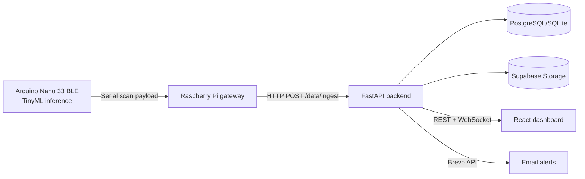

# Architecture Overview

## 1. High-level design
The system combines edge inference, IoT telemetry, and cloud services:

1. **Edge AI device (Arduino Nano 33 BLE)** runs leaf disease inference.
2. **Raspberry Pi gateway** receives serial scan payloads and posts to backend.
3. **FastAPI backend** handles ingestion, persistence, auth, forecasting, and notifications.
4. **React frontend** consumes REST/WebSocket APIs for real-time dashboards.
5. **Storage** uses SQL database for core records and Supabase for image assets.

## 2. Data flow

## 3. Backend responsibilities
- Sensor and disease ingestion endpoints
- Risk scoring and forecasting logic
- Auth/token handling for dashboard access
- Alert triggers (disease and forecast conditions)
- Serving historical and real-time data to frontend

## 4. Frontend responsibilities
- Live status cards and trend charts
- Disease results and recommendations
- Forecast/risk display panels
- User settings (including alert preferences)
- Bilingual rendering support

## 5. Deployment topology
Typical deployment splits:
- Frontend on **Vercel**
- Backend on **Render**/**Docker host**
- Managed PostgreSQL (or SQLite for local development)
- Supabase object storage for scanned/training images

See [DEPLOYMENT.md](./DEPLOYMENT.md) for production setup.
