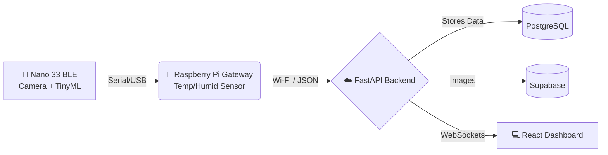

<div align="center">

# 🥭 Intelligent Mango Health Monitoring
### *Edge AI & IoT for Resilient Agriculture in Ethiopia*

<p align="center">
  
  
  
  
  
  
</p>

[**Live Demo**](https://mango-guard.vercel.app/)

---

An end-to-end smart agriculture system combining **embedded AI**, **environmental sensing**, and a **full-stack bilingual dashboard** (English/Amharic) to detect mango leaf diseases and forecast risks in real-time.

</div>

<br>

## ✨ Core Features

| Feature | Description |
| :--- | :--- |
| 📸 **Edge AI Detection** | Detects **Anthracnose** & **Powdery Mildew** directly in the field using a quantized MobileNetV1 model on an Arduino Nano 33 BLE. No internet required for inference. |
| 🌡️ **Risk Engine** | A Raspberry Pi Gateway tracks live temperature & humidity, evaluating disease risk based on expert agronomic thresholds. |
| 🔮 **24-Hour Forecasting** | Leverages Edge Impulse Linux SDK to analyze the last 24 hours of environmental data and predict the upcoming day's disease risk. |
| 🌍 **Bilingual Dashboard** | Real-time React dashboard delivering live readings, trends, and actionable mitigating advice in both English and Amharic. |
| ☁️ **Cloud Storage** | Secure, scalable storage for all scanned mango leaves and model training data using Supabase. |

<br>

## 🏗️ System Architecture



<br>

## 🚀 Getting Started

### 1. Firmware & Gateway
Flash the Edge AI Node using the **Arduino IDE**:
1. Open `firmware/nano33_edgeAI_serial/nano33_edgeAI_serial.ino` in Arduino IDE.
2. Compile and upload to your Arduino Nano 33 BLE.

Run the Raspberry Pi Gateway:
```bash
cd firmware/raspberry_gateway
pip install -r requirements.txt
python gateway_serial.py
```
*(Make sure to configure your API keys in the gateway script)*

### 2. Backend (FastAPI)
You can run the backend via Docker or locally. Ensure you have your `SUPABASE_URL` and `SUPABASE_KEY` configured in your environment.
```bash
# Option A: Docker (Recommended)
docker-compose up -d

# Option B: Local Python
cd backend
pip install -r requirements.txt
uvicorn app.main:app --host 0.0.0.0 --port 8000
```
*API Docs available at: `http://localhost:8000/docs`*

### 3. Frontend (React)
```bash
cd frontend
npm install
npm start
```
*Create a `.env` file with `REACT_APP_API_BASE_URL=http://localhost:8000` before starting.*

<br>

## 📊 ML Model Summary

- **Architecture:** MobileNetV1 (Quantized) & TreeEnsemble (.eim)
- **Accuracy:** 86.45% on real-world Ethiopian farm datasets.
- **Classes:** Anthracnose, Powdery Mildew, Healthy.

<br>

<div align="center">
  <i>Built to bridge the gap between AI and smallholder agriculture in Ethiopia.</i>
</div>
